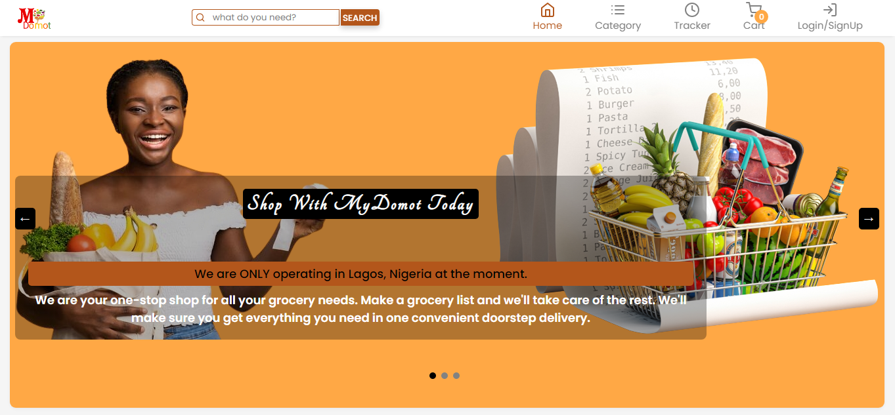
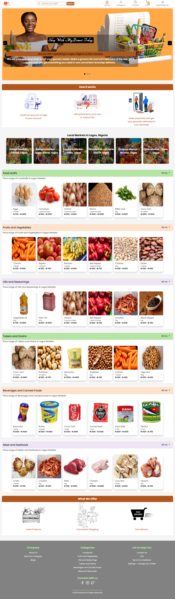

<!-- Project Shields -->
<a name="readme-top"></a>


<div align="center">

  [![Contributors][contributors-shield]][contributors-url]
  [![Forks][forks-shield]][forks-url]
  [![Stargazers][stars-shield]][stars-url]
  [![Issues][issues-shield]][issues-url]
</div>

<!-- Project Logo -->
<br />
<div align="center">
  <a href="https://github.com/teqbaddie/MyDomot">
    
  </a>
</div>

<br />

<div>
  <p align="center">
    <a href="https://github.com/teqbaddie/MyDomot#readme"><strong>Explore the docs »</strong></a>
    <br />
    <br />
    <a href="https://mydomot.vercel.app">View Project Live</a>
    ·
    <a href="https://github.com/teqbaddie/MyDomot/issues">Report Bug</a>
    ·
    <a href="https://github.com/teqbaddie/MyDomot/issues">Request Feature</a>
  </p>
</div>

---

<!-- Table of Contents -->
<details>
  <summary>Table of Contents</summary>
  <ol>
    <li>
      <a href="#about-mydomot">About MyDomot</a>
      <ul>
        <li><a href="#technologies-used">Technologies Used</a></li>
      </ul>
    </li>
    <li>
      <a href="#lessons-learned">Lessons Learned</a>
    </li>
    <li>
      <a href="#usage">Usage</a>
      <ul>
        <li><a href="#prerequisites">Prerequisites</a></li>
        <li><a href="#installation">Installation</a></li>
      </ul>
    </li>    
    <li><a href="#sample">Sample</a></li>
  </ol>
</details>

---


<!-- Markdown Links & Images -->
[contributors-shield]: https://img.shields.io/github/contributors/teqbaddie/MyDomot.svg?style=for-the-badge
[contributors-url]: https://github.com/teqbaddie/MyDomot/graphs/contributors
[forks-shield]: https://img.shields.io/github/forks/teqbaddie/MyDomot.svg?style=for-the-badge
[forks-url]: https://github.com/teqbaddie/MyDomot/network/members
[stars-shield]: https://img.shields.io/github/stars/teqbaddie/MyDomot.svg?style=for-the-badge
[stars-url]: https://github.com/teqbaddie/MyDomot/stargazers
[issues-shield]: https://img.shields.io/github/issues/teqbaddie/MyDomot.svg?style=for-the-badge
[issues-url]: https://github.com/Teqbaddie/MyDomotissues
[html5]: https://img.shields.io/badge/html5-%23E34F26.svg?style=for-the-badge&logo=html5&logoColor=white
[css3]: https://img.shields.io/badge/css3-%231572B6.svg?style=for-the-badge&logo=css3&logoColor=white
[bootstrap]: https://img.shields.io/badge/bootstrap-%23563D7C.svg?style=for-the-badge&logo=bootstrap&logoColor=white
[javascript]: https://img.shields.io/badge/javascript-%23323330.svg?style=for-the-badge&logo=javascript&logoColor=%23F7DF1E
[react]: https://img.shields.io/badge/react-%2320232a.svg?style=for-the-badge&logo=react&logoColor=%2361DAFB

<!-- About the Project -->
## About MyDomot


MyDomot is a technology-driven personal shopping service that connects individuals with local personal shoppers who can purchase groceries on their behalf. Our platform allows customers to submit a list of items they need and we match them with a personal shopper who can purchase the items and deliver them to the customer's doorstep. Our goal is to make raw food items and grocery shopping hassle-free and convenient for our customers, while providing access to fresh and healthy food items.

MyDomot is a React-based online shopping web application that allows users to purchase grocery items from local stores. Users can search for items, add them to their shopping cart, and check out. The application also includes features such as order tracking, customer reviews, and customer service.

Our application provides a wide range of features, such as:
- A shopping cart that allows users to add and remove items from their cart
- A search bar that makes it easy to find the items you need
- An item details page that gives users more information about each item
- A checkout process that allows users to enter their payment information securely
- A delivery tracking system that allows users to track their orders in real-time
- A customer support system that provides users with quick responses to their inquiries

We are also committed to providing a secure and reliable shopping experience. Our application leverages the latest security measures to ensure that all user data is protected and that all transactions are safe and secure.

We are constantly working to improve our application and add new features. If you have any ideas or suggestions for how we can make MyDomot even better, please let us know.

### Technologies Used

MyDomot is a React-based application, built with the following technologies: 

- ![HTML5][html5]
- ![CSS3][css3]
- ![JavaScript][javascript]
- ![React][react]

<p align="right"><a href="#readme-top">back to top</a></p>

---

<!-- Lessons from the Project -->
## Lessons Learned

This project has been an excellent learning experience for me. I have had the opportunity to learn how to use React to create an online shopping application, as well as how to implement various features such as a shopping cart, search bar, item details page, checkout process, delivery tracking system, and customer support system. I have also had the chance to gain a better understanding of web technologies such as HTML, CSS, and JavaScript. I also made this project fully responsive on all devices, I went through processes like debugging and documenting of codes.

<p align="right"><a href="#readme-top">back to top</a></p>

---

<!-- GETTING STARTED -->
## Usage

To get a local copy up and running, follow the steps below.

### Prerequisites

The following technologies are required to run the application:
* [Node.js](https://nodejs.org/en/)
* [React](https://reactjs.org/)

### Installation

To get started, clone the repository and run the following commands:

1. Clone the repository
```bash
git clone https://github.com/teqbaddie/MyDomot.git
```
2. Install dependencies
```bash
npm install
```
3. Run the application
```bash
npm start
```
This will start the application on `http://localhost:3000`.

<p align="right"><a href="#readme-top">back to top</a></p>

---

<!-- Sample -->
## Sample

<br />

<div align="center">
  <a href="https://github.com/teqbaddie/MyDomot">
    
  </a>
</div>


<br/>

<p align="right"><a href="#readme-top">back to top</a></p>

---
